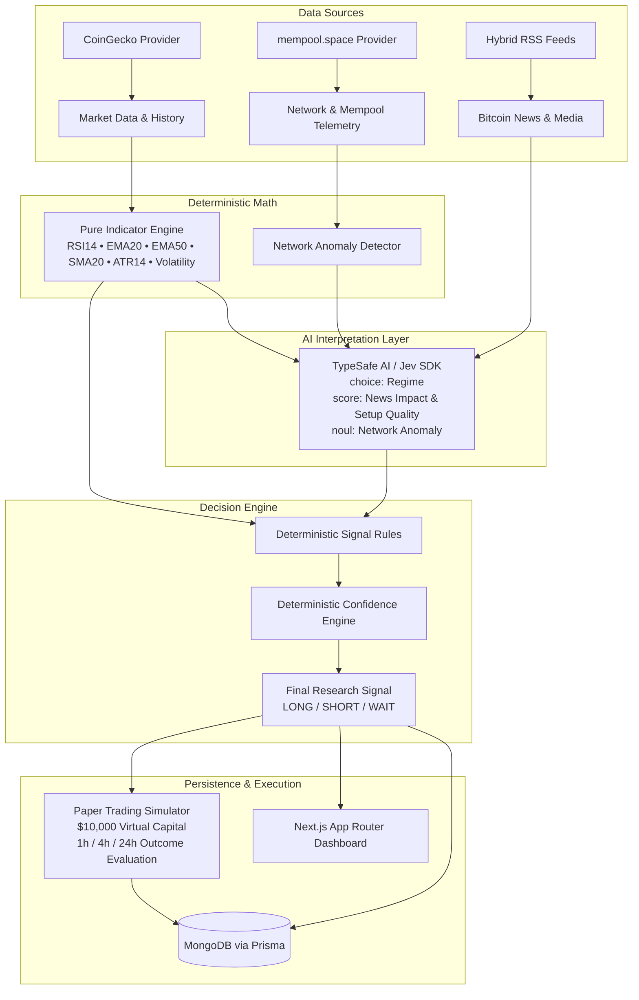

# BTC Signal Engine

Production-quality, maintainable Bitcoin intelligence platform for quantitative research, historical evaluation, and paper trading built with a strict **feature-based architecture**.

> **Architectural Principle:**  
> **Jev interprets ambiguous qualitative information. TypeScript calculates deterministic indicators and makes the final signal decision.**

The system **never connects to live exchanges and never places real orders**. All execution is strictly paper trading simulation.

---

## 1. Pipeline Architecture



---

## 2. Feature-Based Structure

The repository enforces strict feature boundaries. No business logic belongs in generic global folders.

```text
btc-signal-engine/
│
├── .agents/                        # Specialized sub-agent specifications
│   ├── btc-engineer.md
│   ├── data-engineer.md
│   ├── technical-engineer.md
│   ├── jev-engineer.md
│   ├── signal-engineer.md
│   ├── paper-trading-engineer.md
│   └── frontend-engineer.md
│
├── app/                            # Next.js 15 App Router
│   ├── page.tsx                    # Landing page
│   ├── layout.tsx                  # Global theme & typography
│   ├── globals.css                 # Tailwind base styles
│   ├── dashboard/                  # Intelligence dashboard
│   │   ├── page.tsx
│   │   └── loading.tsx
│   └── api/                        # Typed API route handlers
│       ├── market/route.ts
│       ├── network/route.ts
│       ├── news/route.ts
│       ├── analysis/route.ts
│       ├── analyze/route.ts
│       ├── cron/route.ts
│       └── signals/
│           ├── route.ts
│           └── history/route.ts
│
├── src/
│   ├── features/                   # Self-contained feature modules
│   │   ├── market/                 # BTC price, volume, 24h change, CoinGecko
│   │   │   ├── components/MarketCard.tsx
│   │   │   ├── schemas/market.schema.ts
│   │   │   ├── services/coingecko.service.ts
│   │   │   ├── types/market.types.ts
│   │   │   └── index.ts
│   │   ├── network/                # Mempool, fees, block height, anomalies
│   │   │   ├── components/NetworkCard.tsx
│   │   │   ├── schemas/network.schema.ts
│   │   │   ├── services/mempool.service.ts
│   │   │   ├── services/anomaly.service.ts
│   │   │   ├── types/network.types.ts
│   │   │   └── index.ts
│   │   ├── news/                   # Multi-source RSS & CryptoPanic aggregator
│   │   │   ├── components/NewsFeed.tsx
│   │   │   ├── schemas/news.schema.ts
│   │   │   ├── services/rss.service.ts
│   │   │   ├── services/cryptopanic.service.ts
│   │   │   ├── services/news.service.ts
│   │   │   ├── types/news.types.ts
│   │   │   └── index.ts
│   │   ├── technical-analysis/     # Pure mathematical indicators
│   │   │   ├── components/TechnicalCard.tsx
│   │   │   ├── indicators/rsi.ts
│   │   │   ├── indicators/ema.ts
│   │   │   ├── indicators/sma.ts
│   │   │   ├── indicators/atr.ts
│   │   │   ├── indicators/volatility.ts
│   │   │   ├── services/technical-analysis.service.ts
│   │   │   ├── types/technical.types.ts
│   │   │   └── index.ts
│   │   ├── jev/                    # TypeSafe AI System One interpretation
│   │   │   ├── components/JevCard.tsx
│   │   │   ├── prompts/jev.prompts.ts
│   │   │   ├── schemas/jev.schema.ts
│   │   │   ├── services/jev.service.ts
│   │   │   ├── types/jev.types.ts
│   │   │   └── index.ts
│   │   ├── signal/                 # Deterministic rules & confidence
│   │   │   ├── components/SignalCard.tsx
│   │   │   ├── rules/signal.rules.ts
│   │   │   ├── services/confidence.service.ts
│   │   │   ├── services/signal.service.ts
│   │   │   ├── types/signal.types.ts
│   │   │   └── index.ts
│   │   ├── paper-trading/          # Simulated orders & outcomes
│   │   │   ├── components/PaperTradingCard.tsx
│   │   │   ├── services/paper-trading.service.ts
│   │   │   ├── services/outcomes.service.ts
│   │   │   ├── types/paper-trading.types.ts
│   │   │   └── index.ts
│   │   ├── history/                # Decision persistence & filtering
│   │   │   ├── components/HistoryTable.tsx
│   │   │   ├── services/history.service.ts
│   │   │   ├── types/history.types.ts
│   │   │   └── index.ts
│   │   └── analysis/               # 12-step pipeline orchestrator
│   │       └── services/orchestrator.service.ts
│   │
│   ├── shared/                     # True cross-cutting infrastructure
│   │   ├── database/prisma.ts      # Prisma client singleton
│   │   ├── errors/app-error.ts     # Strongly typed error hierarchy
│   │   ├── http/fetcher.ts         # Resilient fetch with timeout
│   │   ├── logger/logger.ts        # Structured JSON logger
│   │   └── utils/formatters.ts     # Currency, percentage, timestamp helpers
│   │
│   └── config/
│       └── env.ts                  # Zod validated runtime environment
│
├── prisma/
│   └── schema.prisma               # MongoDB Prisma Schema
│
├── scripts/
│   └── run-analysis.ts             # Standalone CLI pipeline runner
│
├── tests/                          # Vitest unit & integration test suites
│   ├── foundation.test.ts
│   └── features/
│       ├── market/
│       ├── network/
│       ├── news/
│       ├── technical-analysis/
│       ├── jev/
│       ├── signal/
│       └── paper-trading/
│
├── .env.example
├── package.json
├── tsconfig.json
├── tailwind.config.ts
└── vitest.config.ts
```

---

## 3. Technology Stack

- **TypeScript** (Strict mode, no `any`, no `@ts-ignore`, external Zod validation)
- **Next.js 15** (App Router, Server Components & Route Handlers)
- **React 19**
- **Tailwind CSS** (Dark mode theme optimized for financial telemetry)
- **Prisma ORM** with **MongoDB** provider (`mongodb://...`)
- **@typesafe-ai/sdk** (Official TypeSafe AI System One / Jev SDK)
- **Vitest** (High-speed unit and integration test runner)
- **Zod** (Runtime schema validation for all external APIs and data structures)

---

## 4. Setup & Installation

### Prerequisites
- Node.js >= 20
- MongoDB (Running locally or MongoDB Atlas connection string)

### 1. Clone & Install
```bash
git clone <repo-url>
cd BTC-news
npm install
```

### 2. Configure Environment Variables
Copy `.env.example` to `.env`:
```bash
cp .env.example .env
```

Edit `.env`:
```env
# MongoDB Connection String (MongoDB requires a replica set for Prisma transactions)
DATABASE_URL="mongodb://127.0.0.1:27017/btc_signal_engine?replicaSet=rs0&directConnection=true"

# TypeSafe AI / Jev API Key (Optional: system degrades gracefully to neutral/WAIT if omitted)
TYPESAFE_API_KEY=""

# Optional CoinGecko Key (Defaults to public endpoint with rate-limit handling)
COINGECKO_API_KEY=""

# Optional CryptoPanic Key (Defaults to public RSS feeds from CoinDesk, Cointelegraph, Decrypt)
NEWS_API_KEY=""

# App Settings
NODE_ENV="development"
ANALYSIS_INTERVAL_MINUTES=5
PAPER_STARTING_BALANCE=10000
```

### 3. Push Database Schema to MongoDB
```bash
npx prisma db push
```

---

## 5. Running the Application

### Next.js Interactive Dashboard
```bash
npm run dev
```
Open [http://localhost:3000](http://localhost:3000) or [http://localhost:3000/dashboard](http://localhost:3000/dashboard).

### CLI Pipeline Runner
Run the 12-step deterministic analysis directly from your terminal:
```bash
npm run analyze
```

---

## 6. Verification & Testing

Run unit tests across all features:
```bash
npm test
```

Run strict TypeScript typechecking:
```bash
npm run typecheck
```

Run production build verification:
```bash
npm run build
```

---

## 7. Deterministic Signal & Confidence Engine

Signals are generated using strict deterministic rules:
- **`LONG`**:
  - Technical: Price > EMA20 > EMA50, RSI in ideal expansion band (48–74).
  - Jev AI: Regime classified as `bullish`, news bias not bearish, setup quality >= 6.0/10.
  - Network: No critical fee spikes or severe congestion anomalies.
- **`SHORT`**:
  - Technical: Price < EMA20 < EMA50, RSI in downward expansion band (26–52).
  - Jev AI: Regime classified as `bearish`, news bias not bullish, setup quality >= 6.0/10.
  - Network: Normal or acceptable network state.
- **`WAIT`**:
  - Any conflicting evidence between technicals and Jev regime.
  - Extreme momentum exhaustion (RSI >= 78 or <= 22).
  - Severe network / mempool anomalies (fastest fee > 100 sat/vB or rapid backlog surge).
  - Degraded mode (when `TYPESAFE_API_KEY` is not configured).

### Confidence Formula (0 to 100%)
$$\text{Total Confidence} = \text{Technical Score} (35) + \text{Regime Score} (30) + \text{News Score} (20) + \text{Network Score} (15) - \text{Deductions}$$

Deductions apply for:
- Network anomaly (-25 pts)
- Return volatility > 5% (-20 pts)
- RSI exhaustion (-20 pts)
- Degraded mode (-35 pts)

---

## 8. Paper Trading & Historical Outcomes

- Starts with **$10,000 virtual capital**.
- Simulated orders only: position sizing is calculated at 20% allocation per trade.
- Automated evaluation with **Take Profit (+3.5%)** and **Stop Loss (-1.8%)**.
- Every decision is recorded in MongoDB with all 15 input metrics for full reproducibility.
- Fixed outcome tracking at **1 hour**, **4 hours**, and **24 hours** without lookahead bias.

---

## 9. Sub-Agent Architecture

Detailed sub-agent prompts and boundary definitions are maintained under `.agents/`:
- `btc-engineer.md`: Lead architect, integration, and verification
- `data-engineer.md`: Market, Network, and News data ingestion
- `technical-engineer.md`: Deterministic mathematical indicators
- `jev-engineer.md`: TypeSafe AI / Jev SDK integration
- `signal-engineer.md`: Deterministic signal and confidence engine
- `paper-trading-engineer.md`: Paper trading and outcome evaluation
- `frontend-engineer.md`: Next.js App Router dashboard UI

---

## 10. Known Limitations & Future Improvements

- **Jev API Key**: Without an active `TYPESAFE_API_KEY`, Jev runs in graceful degraded mode (neutral interpretation, defaulting signals to WAIT for safety). Provide a valid key in `.env` to activate full System One AI inference.
- **Future Improvements**:
  - Add WebSocket streaming for live tick-by-tick orderbook depth.
  - Multi-asset expansion (ETH, SOL) following the same feature-based pattern.
  - Monte Carlo simulation on historical signal outcomes.
